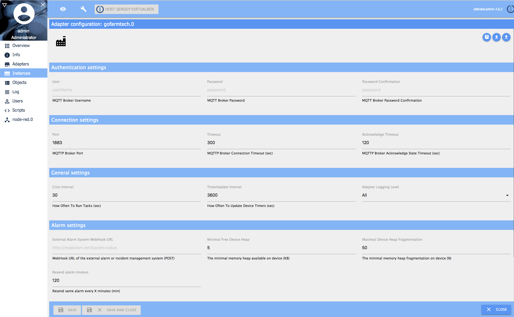

# ioBroker GoFarmTech
=================

This adapter provides the integration of [GoFarmTech](https://github.com/bratello/GoFarmTech) based multifunction microcontroller with the ioBorker home automation and allow the communication between device and ioBroker via MQTT.
It includes both code running within iobroker and separate Web UI for device administration.

## Main Keys
 - Automatic device registration
 - Automatic WebUI Settings generation for registered device
 - Abbility to configure devices and sensors in offline
 - Per-Sensor Alarm settings (see [sensor alarm](admin/sensorAlarmSettings.png) settings tab)
 - WebHook integration with external Alarm/Incident Management System (see [adapter](admin/adapterSettings.png) settings, alarm section)

## Dependencies
1. web ioBroker Adapter (installed automatically)

## Installation and configuration 
1. Go to the Adapters tab within ioBroker admin page.
2. Choose the "Install from custom URL" button and specify the adapter's github location:
  ```https://github.com/bratello/ioBroker.gofarmtech```
3. The new GoFarmTech adapter was installed. Press the ```+``` icon to install the new adapter instance
4. Go to the Instances ioBroker tab, and press the wrench icon of the newly created instance - instance settings page appears.

5. Specify relevant connection settings. Change the Port in case the instance failed after the installation, probably the port #1883 was acquired by other adapter.
6. Go to the [device settings](https://github.com/bratello/GoFarmTech/blob/master/README.md) and specify same connection settings as well.
7. Restart device. Go to the Objects ioBroker tab - the new entry will be created in gofarmtech.{your instance id}.devices folder, which means that new device was connected and successfully installed in GoFarmTech adapter instance. Check device settings in case you have troubles with initial device initialisation.  
8. Go back to the Instances tab and press the right arrow icon near the adapter's instance. The device administation Web UI will be shown.
	- Timer Settings

	- Sensor Settings

	- Sensor Alarm Settings


## Changelog

## License
The MIT License (MIT)

Copyright (c) 2019 bratello <https://github.com/bratello>

Permission is hereby granted, free of charge, to any person obtaining a copy
of this software and associated documentation files (the "Software"), to deal
in the Software without restriction, including without limitation the rights
to use, copy, modify, merge, publish, distribute, sublicense, and/or sell
copies of the Software, and to permit persons to whom the Software is
furnished to do so, subject to the following conditions:

The above copyright notice and this permission notice shall be included in
all copies or substantial portions of the Software.

THE SOFTWARE IS PROVIDED "AS IS", WITHOUT WARRANTY OF ANY KIND, EXPRESS OR
IMPLIED, INCLUDING BUT NOT LIMITED TO THE WARRANTIES OF MERCHANTABILITY,
FITNESS FOR A PARTICULAR PURPOSE AND NONINFRINGEMENT. IN NO EVENT SHALL THE
AUTHORS OR COPYRIGHT HOLDERS BE LIABLE FOR ANY CLAIM, DAMAGES OR OTHER
LIABILITY, WHETHER IN AN ACTION OF CONTRACT, TORT OR OTHERWISE, ARISING FROM,
OUT OF OR IN CONNECTION WITH THE SOFTWARE OR THE USE OR OTHER DEALINGS IN
THE SOFTWARE.
